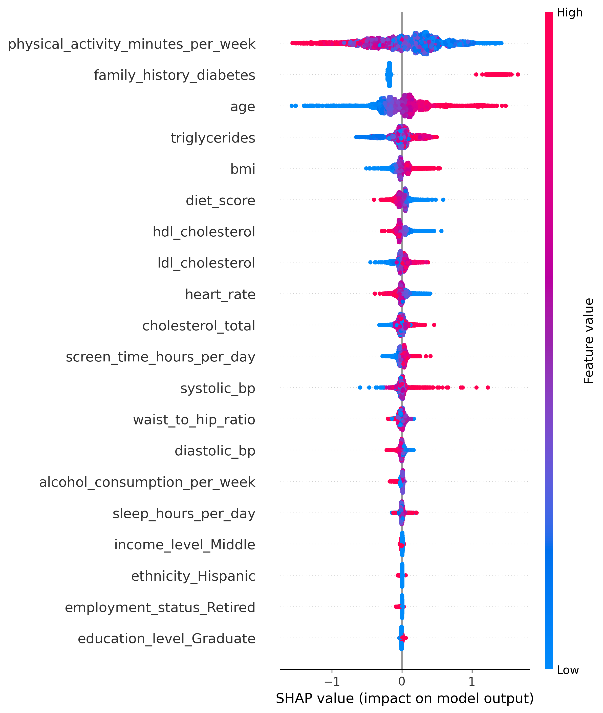
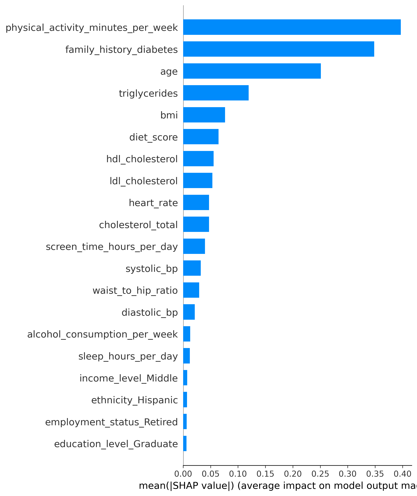

# 糖尿病风险预测：XGBoost 表格分类实验

本项目基于 Kaggle 生成数据，使用 XGBoost 原生接口构建 `diagnosed_diabetes` 二分类概率预测模型，记录固定参数交叉验证、训练轮数选择、阈值评估和模型解释过程。

**数据为机器学习竞赛生成数据。所有结果仅用于机器学习实验，不代表真实医疗诊断结论，也不能作为个人患病风险评估或临床决策依据。**

当前固定参数 XGBoost 的 5-fold Mean ROC-AUC 为 **0.7269232819**，最终模型使用 **1991** 个 boosting rounds。本文仅收录实际运行中记录的结果；没有可核验数值的实验会明确标注。

## 数据与任务

数据来源：[Kaggle Diabetes Prediction Challenge，Playground Series S5E12](https://www.kaggle.com/competitions/playground-series-s5e12/data)。官方说明：竞赛训练集和测试集由在 Diabetes Health Indicators Dataset 上训练的深度学习模型生成，其分布与原始数据并不完全一致。本项目使用竞赛的 `train.csv` 和 `test.csv`，未引入原始数据集。

以下统计来自本地文件核验：

| 项目 | 数值或说明 |
| --- | --- |
| 训练集 | 700,000 行、26 列，包含 ID 和目标列 |
| 测试集 | 300,000 行、25 列，不包含目标列 |
| 目标列 | `diagnosed_diabetes`；0 / 1 为数据集中的阴性 / 阳性标签 |
| 阴性样本 | 263,693 |
| 阳性样本 | 436,307，约 62.33% |
| 缺失值 | 当前训练集和测试集均为 0 |
| ID 核验 | 两个文件各自无重复 ID，训练集与测试集 ID 无交集 |
| 模型输入 | 预处理后 39 个特征 |
| 预测输出 | 阳性类别的模型概率，不在提交文件中转换为 0 / 1 |

特征涵盖人口统计、生活方式、体征、血脂和既往病史，例如 `age`、`bmi`、`physical_activity_minutes_per_week`、`triglycerides`、`family_history_diabetes`。`id` 不作为模型特征。测试集没有公开标签，本文不报告测试集 ROC-AUC 或 Kaggle 排名。

数据文件不随当前版本分发。下载位置与放置方式见 [data/README.md](data/README.md)。

## 数据预处理

现有 `model.py` 和 `compare_model.py` 使用相同的 One-Hot 处理方式：

1. 从训练集和测试集中删除 `gender`。这是现有实现，尚无消融实验支持该操作能改善效果。
2. 合并训练集和测试集，对 `ethnicity`、`education_level`、`income_level`、`smoking_status`、`employment_status` 调用 `pd.get_dummies(dummy_na=False)`。
3. 按原始行数拆回两个数据集，训练特征中移除 `id` 和 `diagnosed_diabetes`。
4. XGBoost 预测前以训练特征列为模板，通过 `reindex(..., fill_value=0)` 对齐测试特征，并断言两个 `DMatrix` 的特征名一致。

合并操作会在测试部分临时产生空目标列，但该列不会进入模型输入。XGBoost 流程未做标准化、重采样或手工缺失值填补，也未设置 `scale_pos_weight`。Logistic Regression 的标准化由每折训练数据上的 `Pipeline` 完成。

**当前编码发生在交叉验证划分之前，并使用了测试集的类别集合。** 它没有使用测试标签，但不是严格的逐折 fit/transform 预处理；本文不把它描述为完全避免信息泄漏的流程。本轮仓库整理保留了这项实现。

## 模型方法

主模型使用 `xgb.DMatrix` 和 `xgb.train`，目标函数为 `binary:logistic`，评估指标为 ROC-AUC，树构建方法为 `hist`。

冻结的 `BEST_PARAMS` 如下：

```python
BEST_PARAMS = {
    "objective": "binary:logistic",
    "eval_metric": "auc",
    "tree_method": "hist",
    "seed": 42,
    "max_depth": 7,
    "eta": 0.019070735300789274,
    "subsample": 0.8880712253010263,
    "colsample_bytree": 0.6056361014783196,
    "min_child_weight": 1,
    "gamma": 0.7357120004150447,
    "lambda": 2.5012429768287956,
}
```

### Optuna

此前已完成 30 次 trials，以 5-fold 平均 ROC-AUC 为目标；最佳为 Trial 12，记录值为 **0.7269175652**。搜索涉及树深、学习率、行采样、列采样、最小子节点权重、`gamma` 和 L2 正则化参数。

当前脚本直接使用上述冻结参数，**不会启动 Optuna**。历史搜索代码可在 Git 历史中的 `17d7043:model.py` 查阅，但当前目录没有独立调参入口，也未保存完整 study 数据库或全部 trial 日志。

历史搜索代码的验证预测未显式指定最佳迭代范围；当前 CV 已修正这一点。因此历史搜索分数与当前 CV 分数代表不同版本的评估实现，不据此宣称模型性能提升。

### 5-fold CV 与 Early Stopping

`evaluate_best_xgb()` 使用 `StratifiedKFold(n_splits=5, shuffle=True, random_state=42)`。每折训练上限为 `num_boost_round=2000`，在该折验证集上按 AUC 执行 `early_stopping_rounds=50`。

验证预测显式使用：

```python
iteration_range=(0, model.best_iteration + 1)
```

`best_iteration` 从 0 开始，预测范围的结束位置不包含在内，因此有效训练轮数需要加 1。最终模型在全部训练数据上重新训练，轮数取各折 `best_iteration + 1` 的中位数，不再固定为 500。

## 实验结果

下列模型指标来自此前开发过程中的实际运行输出，本次整理没有重新训练或调参。原始控制台日志、OOF 概率数组和 Optuna study 未持久化到仓库；本文是这些已记录结果的整理，不是完整实验追踪系统。

### 固定参数 XGBoost

| Fold | ROC-AUC | best_iteration（从 0 开始） | 有效轮数 |
| --- | ---: | ---: | ---: |
| 1 | 0.727335 | 1972 | 1973 |
| 2 | 0.725793 | 1999 | 2000 |
| 3 | 0.726690 | 1987 | 1988 |
| 4 | 0.727837 | 1993 | 1994 |
| 5 | 0.726961 | 1990 | 1991 |

- 各折 AUC 的算术平均：**0.7269232819**。该值来自未舍入的折分数，不是合并 OOF 概率后的整体 AUC。
- 各折有效轮数的中位数：**1991**，用于最终全量模型训练。
- 表内各折 AUC 展示到小数点后 6 位。

### Early Stopping 诊断

此前仅对第 1 折做过一次诊断，使用相同冻结参数和划分，将训练上限提高至 4000，patience 改为 100。

| Fold | 轮数上限 | Patience | best_iteration | ROC-AUC |
| --- | ---: | ---: | ---: | ---: |
| 1 | 4000 | 100 | 1972 | 0.7273348672 |

第 1 折在该诊断下的最佳迭代位置未变。该实验不能说明其他四折的情况；尤其第 2 折原结果达到索引 1999，仍需单独验证上限是否影响轮数选择。诊断为一次性运行，未接入当前 `model.py`，主流程仍为 2000 / 50。

## Baseline Comparison

`compare_model.py` 已实现两个 baseline，与 XGBoost 使用相同 One-Hot 方式和 `random_state=42` 的分层五折划分：

| 模型 | 当前实现 | 已记录 5-fold Mean ROC-AUC |
| --- | --- | ---: |
| Logistic Regression | `StandardScaler` + `LogisticRegression(max_iter=2000)`，每折单独 fit | 暂无可核验记录 |
| Random Forest | `RandomForestClassifier(n_estimators=100)` | 暂无可核验记录 |
| XGBoost | 冻结 Optuna 参数 + Early Stopping | 0.7269232819 |

Baseline 脚本会输出各折和平均 AUC，但当前可用实验记录中没有 LR / RF 的数值，因此不报告领先幅度，也不声称 XGBoost 优于这些 baseline。现有 Random Forest 未设置 `random_state`，重复运行结果可能变化。

## Threshold Analysis

此前使用相同冻结参数和五折设置收集验证集概率：每条训练样本仅由未使用该样本训练的折模型预测。将所有折的 OOF 概率按样本位置合并后，按 `probability >= threshold` 转为阳性，统一计算正类（标签 1）的 Precision、Recall 和 F1；**不是逐折指标的算术平均**。

| Threshold | Precision | Recall | F1 |
| --- | ---: | ---: | ---: |
| 0.3 | 0.640527 | 0.984181 | 0.776010 |
| 0.4 | 0.667113 | 0.939449 | 0.780198 |
| 0.5 | 0.707761 | 0.840603 | 0.768483 |
| 0.6 | 0.760902 | 0.677926 | 0.717022 |
| 0.7 | 0.822634 | 0.467806 | 0.596437 |

该表来自已执行的一次性实验。当前 `model.py` 未保存 OOF 概率，也不会自动输出该表；仓库尚无独立阈值实验脚本。这里不选择最终阈值，不将表中任何一行视为医疗筛查标准。预测 CSV 始终保留概率。

## Feature Importance

最终 XGBoost 模型训练后，使用 `final_model.get_score(importance_type="gain")` 提取特征重要性，按 gain 降序打印前 20 项。

这反映特征被用于树分裂时带来的平均增益，不提供影响方向。未用于分裂的特征可能不出现在结果中；One-Hot 特征以各自编码列展示，没有按原始类别变量合并。当前只打印结果，没有保存独立 gain 数值文件，本文也不补造排名或数值。

## SHAP

SHAP 已接入最终模型训练之后。使用 `random_state=42` 从编码后的训练数据中随机抽样 5000 条，通过 `shap.TreeExplainer(final_model)` 计算 SHAP 值，以 300 DPI 保存两张展示前 20 个特征的图。

这些图解释的是最终模型在训练样本子集上的输出，不是折外解释或因果效应。当前 TreeExplainer 使用默认 raw 输出，二分类 XGBoost 的 SHAP 值处于 log-odds 尺度，不是概率变化的百分点。此处展示已生成图像，不自动推导医疗结论。

### Summary / Beeswarm



### Bar Summary



图像已在此前完整脚本运行中成功生成；本轮仅整理其保存位置，未重新计算 SHAP。运行主脚本会覆盖这两张图。

## 项目局限

- **外推范围**：数据为 Kaggle 生成数据，未做真实临床数据或外部人群验证；目标为数据中的诊断标签，没有未来发病时间窗口。
- **预处理**：One-Hot 使用了训练集及测试集的类别集合，尚未改为仅在各训练折拟合；删除 `gender` 的影响未经消融验证。
- **评估偏差**：Optuna 使用了同一组 CV 划分选参，Early Stopping 也使用各折验证集选轮数；当前分数不是独立留出集或嵌套 CV 的无偏估计。
- **轮数诊断**：仅第 1 折完成 4000 / 100 诊断，其余折的训练上限问题未排除。
- **对比与阈值**：Baseline 缺少可核验数值，RF 未固定随机种子；阈值分析没有独立验证集确认，也未进行概率校准、误报/漏报成本建模或最终阈值决策。
- **解释范围**：Gain 和 SHAP 描述当前模型的行为，不能证明临床因果关系；SHAP 使用训练样本而非独立测试样本。
- **工程与复现**：未保存最终模型、完整实验日志及 OOF 文件；没有独立推理入口、部署服务或自动化 CI 测试。本项目不声称已具备生产部署能力。

后续可补齐 baseline 的实际结果与日志，再独立开展逐折预处理、轮数诊断和评估改进。上述内容均为待办，未计入已完成成果。

## 项目目录

```text
diabetes_predict_model/
|-- README.md
|-- requirements.txt
|-- .gitignore
|-- model.py                       # 固定参数 CV、最终训练、gain、SHAP、预测
|-- compare_model.py               # Logistic Regression / Random Forest
|-- data/
|   |-- README.md                  # 数据来源与放置方式
|   |-- train.csv                  # 本地数据，Git 忽略
|   `-- test.csv                   # 本地数据，Git 忽略
|-- reports/
|   `-- figures/
|       |-- shap_summary_beeswarm.png
|       `-- shap_summary_bar.png
`-- outputs/
    |-- .gitkeep
    `-- xgb_submission_optuna_onehot.csv  # 运行生成，Git 忽略
```

本地历史预测 CSV 也归入 `outputs/`，未列入上述目录树。保留代码、实验说明和两张较小的 SHAP 图供仓库展示；原始数据、预测 CSV、IDE 配置、环境目录和缓存不纳入当前版本。

## 运行方法与依赖

已验证的本地环境为 Windows + Anaconda，**Python 3.12.12**。`requirements.txt` 按当前环境固定这两个脚本直接使用的第三方依赖：

| 依赖 | 版本 |
| --- | --- |
| pandas | 2.3.3 |
| numpy | 2.1.3 |
| scikit-learn | 1.7.2 |
| xgboost | 3.1.2 |
| matplotlib | 3.10.6 |
| shap | 0.52.0 |

Optuna 仅用于历史搜索，当前两个脚本不导入它，因此未列入运行依赖。本地核验时安装的 Optuna 版本为 4.6.0，这不构成历史全部 trials 的环境记录。依赖文件不是包含所有传递依赖的完整环境锁文件，其他系统上的运行尚未验证。

1. 从上述 Kaggle 页面获取数据并放入 `data/train.csv`、`data/test.csv`。
2. 在仓库根目录打开终端，激活已有 Anaconda 环境。此项目本地使用的环境名为 `tensor`，其他机器应换成自己的环境名。

```powershell
conda activate tensor
python model.py
```

主脚本依次执行 5-fold CV、全量训练、gain 输出、5000 条样本的 SHAP 计算和测试概率保存。它不会运行 Optuna、baseline 或阈值实验。完整运行涉及 70 万条训练样本和六次 XGBoost 训练，请预留运行时间与内存。

如需执行已有 baseline 脚本，在同一环境和仓库根目录运行：

```powershell
python compare_model.py
```

已有环境依赖齐全时无需安装。仅在其他机器需要配置依赖时，可在目标环境中使用：

```powershell
python -m pip install -r requirements.txt
```

本轮整理未下载或安装任何包，也未重新运行训练。输出文件如下：

| 输出 | 位置 |
| --- | --- |
| 各折 AUC、最佳轮数和平均 AUC | 控制台 |
| 前 20 项 gain 特征重要性 | 控制台 |
| SHAP beeswarm | `reports/figures/shap_summary_beeswarm.png` |
| SHAP bar | `reports/figures/shap_summary_bar.png` |
| 测试集概率 | `outputs/xgb_submission_optuna_onehot.csv`，列为 `id,diagnosed_diabetes` |

## GitHub 文件管理

本地 `train.csv` 为 83,302,401 字节，`test.csv` 为 34,565,636 字节，六个历史预测 CSV 合计约 33 MB。这些可重新获取或生成的文件不适合持续提交到源码仓库，已通过 `.gitignore` 排除并停止跟踪；本地文件保留。两张 SHAP 图合计约 0.74 MB，作为展示结果纳入版本管理。

**这些数据和旧预测文件曾进入 Git 历史。** 本次整理只从当前文件树移除它们，不重写历史，因此完整克隆仍会包含旧版本对象，不能将此次整理理解为历史数据彻底清除或仓库体积已经缩小。

作者：张冷
